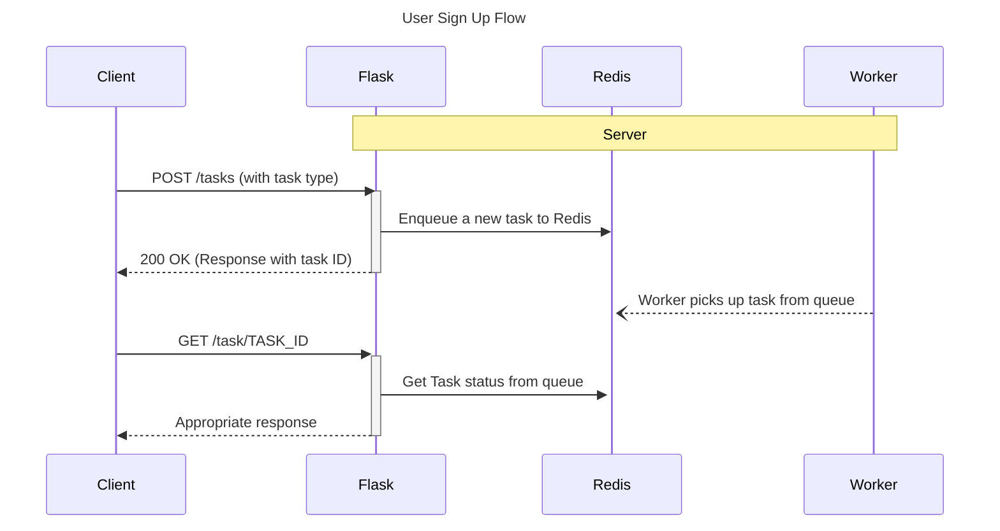

# Flask Redis Queue

Example of how to handle background processes with Flask, Redis Queue, and Docker

## Quick Start

Build and start the Docker container:

```sh
docker-compose up --build
```

Open your Client to <http://localhost:5004>


